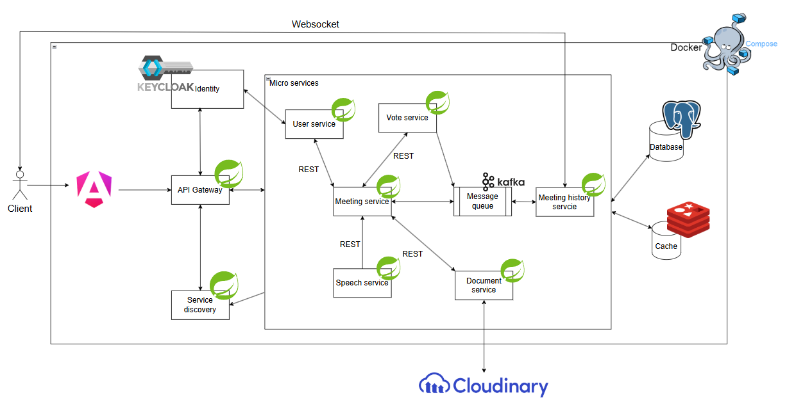
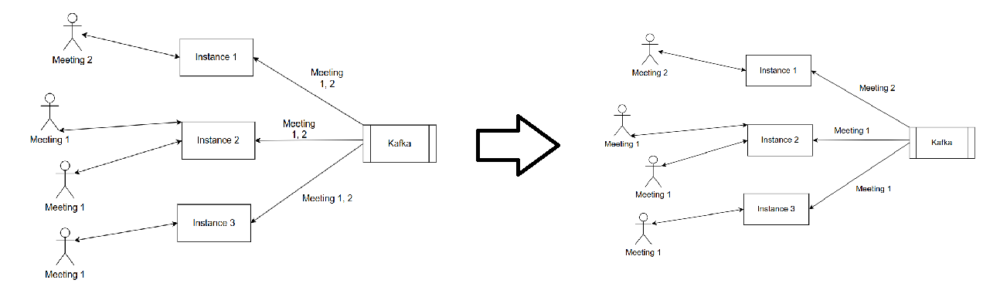
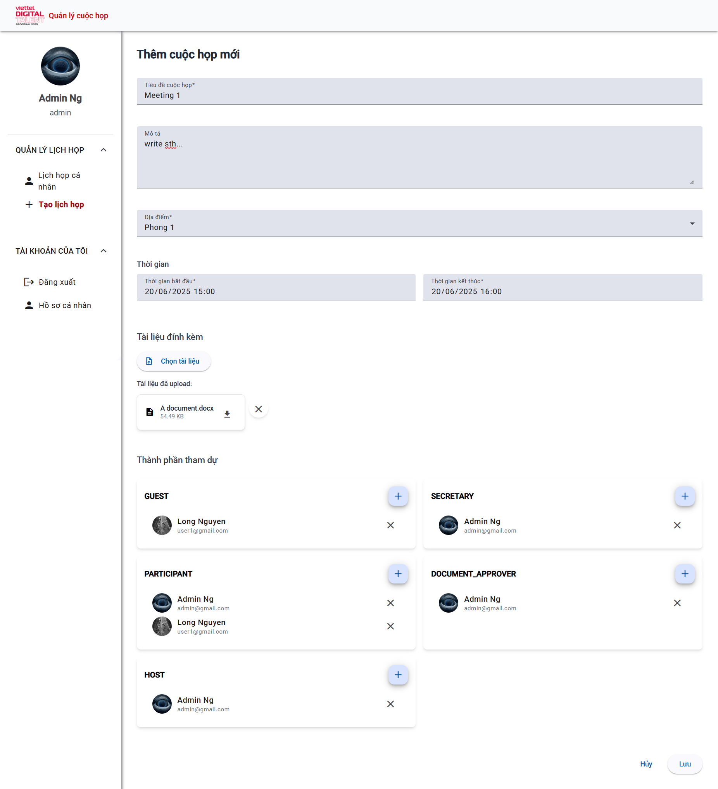
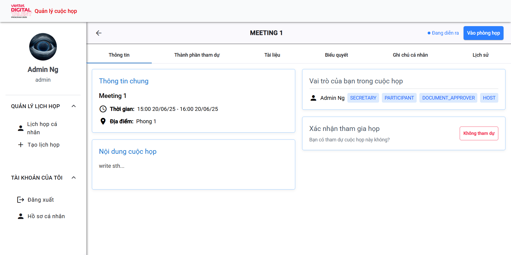
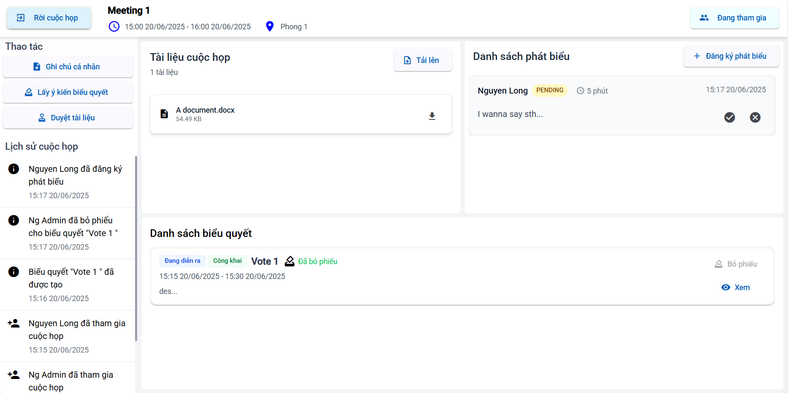
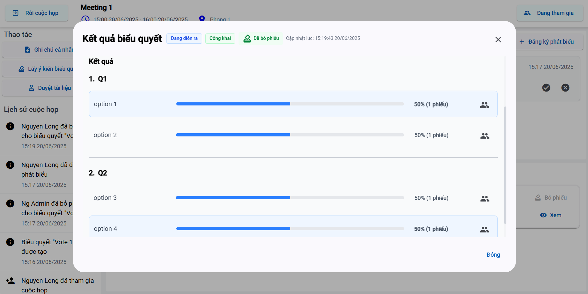

# VDT-miniproject

A meeting schedule / management (No RTC) project aim to practice building a typical microservice application in Java

## Techstack

- Java 21
- Spring boot 3.5.0, Spring cloud gateway, Spring cloud Netflix Eureka
- Angular 19 + TailwindCSS
- Keycloak
- Postgres
- Redis
- Kafka
- Websocket
- Cloudinary

## Key features

- Create / Schedule meetings 

- Voting

- Speech registration

- Document upload

## System architecture



#### Dynamically subscribe to Kafka's topic



## Getting started with Docker compose

1. Get the latest source code

2. Add the following record to your host file:

   (This is a way to prevent 'issuer mismatch' problem in Keycloak when running in local enviroment. If you know any better solution, don't hesitate to let me know)

```
  127.0.0.1 keycloak
```

3. **[Optional]** Change the Cloudinary's url in [.env](https://github.com/NgNhatThanh/VDT-miniproject/tree/main/.env) file, just in case you wanna use file uploading feature

4. Open terminal at the root folder of this project, run `docker compose up -d`, wait for some minutes

5. Access the website via `http://localhost:4200`, you already have an admin account (`admin/123456`)

#### You might also want to explore:

`http://keycloak:8080` for Keycloak console, account `admin/admin`

## Contributing

- Give us a star

- Reporting a bug

- Participate discussions

- Propose new features

- Submit pull requests. If you are new to GitHub, consider to learn how to contribute to a project through forking

By contributing, you agree that your contributions will be licensed under MIT License.
## Screenshots


---

---


